# FoodForThought Volunteer Organizer

## Getting Started

This is FoodForThought's volunteer organization app for iOS and Android. As a volunteer, you can use it to sign up to volunteer, and check in when you arrive. As an administrator, you can check volunteers in, manage times and locations, and send notifications to volunteers that are using the app.

### Requirements

The FoodForThought app requires iOS 8+ or Android 6.1.1+

**Not sure what version you're using?**

Click [here][a9eb7041] to learn how to find your iOS version number

Click [here][90ec8a7d] to learn how to find your Android version number

  [a9eb7041]: https://support.apple.com/en-us/HT201685 "How to check version number in iOS"
  [90ec8a7d]: https://www.howtogeek.com/230737/how-to-find-out-which-version-of-android-you-have/ "How to check version number in Android"

### Installing

To install the FoodForThought app, simply search for "FoodForThought" in the App Store (for iOS users) or the Play Store (for Android users.)

## Features

### Welcome Screen

The first time you open the app, you'll be presented with this screen.

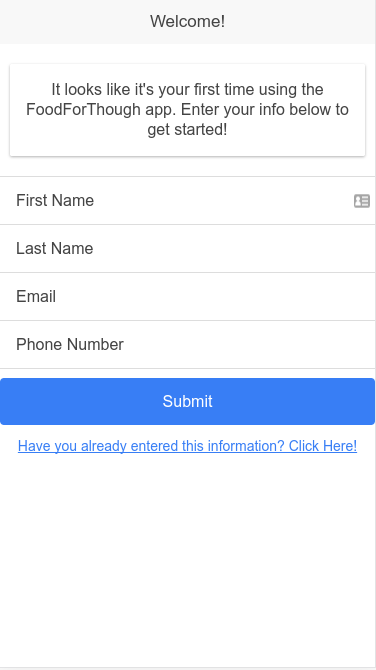

We ask for your name, email and phone number so that we can sign you up to volunteer. You'll need to provide all of these in order to use the app.

If you've already entered your information on a device, but have logged out, you can click the link below the "Submit" button to log back in. To log back in, you only need to provide your email address.

**Note: Your information is not synced between devices, so you won't be able to log in to a device you haven't previously provided information on.**

### Navigation Tabs

You can navigate the different screens of the FoodForThought app using the tabs at the bottom of the screen. The icons represent the "Home", "Notifications", Settings", and "Info" screens. If you are logged in as an admin, the "info" tab will be replaced with an "admin" tab.  The different screen and their functions are listed below.

### Home Screen

This is the main screen of the FoodForThought app. This screen lets you sign up to volunteer, get directions to volunteer locations, and sign in once you arrive.

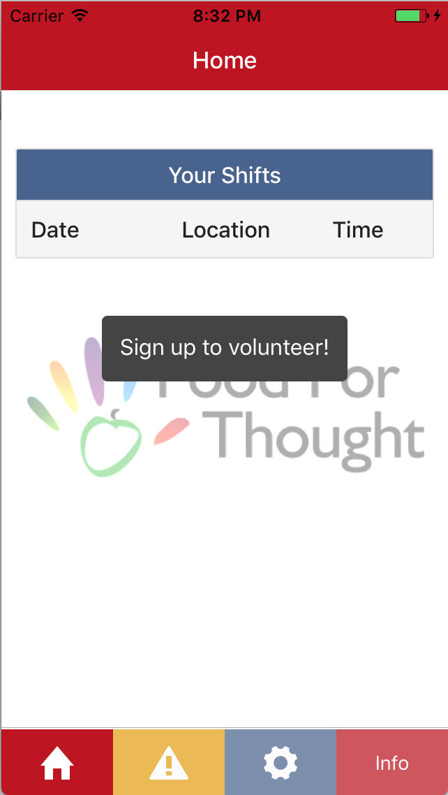

#### "Your Shifts" Tab

If you've already signed up for a shift, it will show up here. Clicking on a shift will show details about the shift, including the time, location, job description, and any additional notes FoodForThought has decided to include, such as weather information. You can get directions to the shift's location by pressing the "Directions" button, and check in when you get there by pressing the "Check In" button.

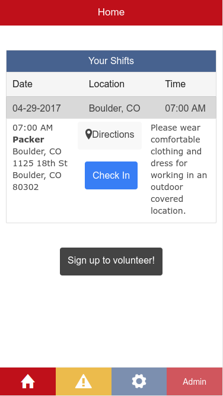

#### Signing up to Volunteer

You can press the "Sign Up to Volunteer" button to sign up for a shift. When you do, you'll see a calendar view where you can select what day you'd like to sign up for. You then have to confirm by selecting the date again. This is a quirk with Salesforce. You will then be prompted for sign up information, which should be re-filled based on the information you provided at the welcome screen.

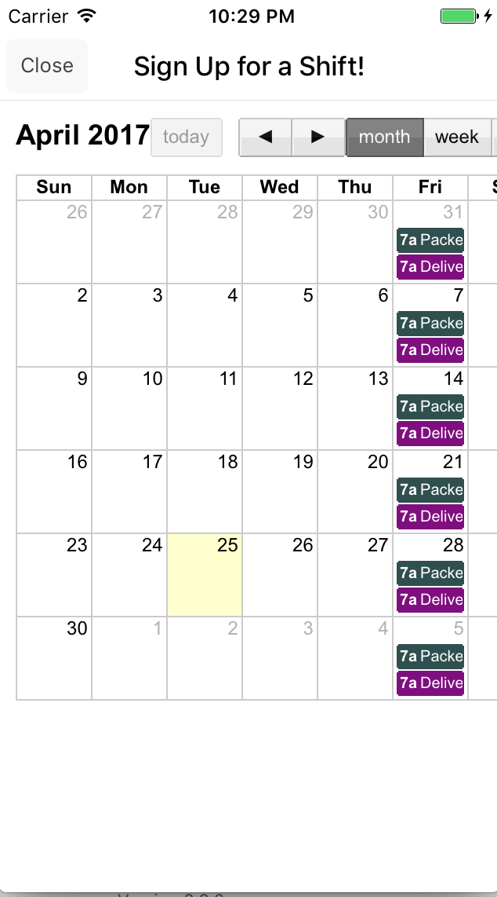

### Notifications Screen

On this screen, you can see any messages FoodForThought has sent out. These are split into regular and urgent notifications. Urgent notifications generally contain information about cancellations or severe weather.

### Settings Screen
**Note: Automatic check-in and log out are currently non-functional**

The settings screen allows you to switch users and enable auto-check in. Enabling auto check in allows you to check in automatically when you're near the volunteer location.

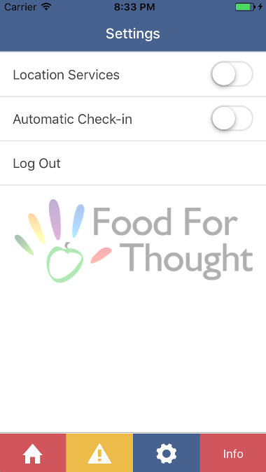

### Info Screen

The info screen contains a brief description of what FoodForThought is all about, and has links to FoodForThought's social media and donation page.

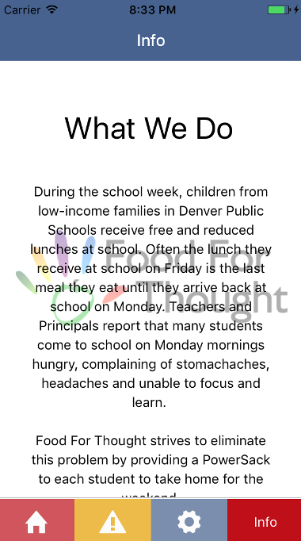

## Admin Features

The admin tab takes the place of the contact screen when an Admin is using the FoodForThought app. From here, you can check volunteers in, create new notifications, and manage shift times and locations.

### Check In

####_This feature is currently non-functional due to back-end issues._

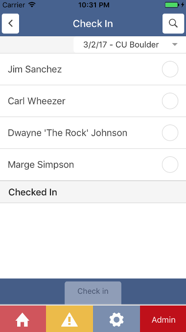

The admin check in screen allows you to check in volunteers that are signed up for a given shift. This allows you to better keep track of volunteers that don't want to use (or can't use) the app.

You can select the shift you want to check volunteers in for using the dropdown box in the upper right of the screen. After selecting a shift, you'll be able to see a list of volunteers that are signed up for that shift.

You can then mark people for check in by pressing the checkboxes on the right side of each name. The selected volunteers can be checked in by pressing the "Check in Selected" button at the bottom of the check in list.

You can search for volunteers using the search button (denoted by a magnifying glass) in he upper right hand corner. Pressing the button and typing in a name will narrow down the list of volunteers to those matching what you've typed in.

### Notifications

####_This feature is currently non-functional due to back-end issues._

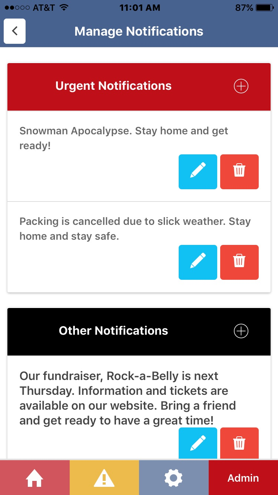

The admin notifications screen allows you to create, edit and delete notifications that will be sent out to volunteers using the FoodForThought app.

Notifications are split into "urgent" and ""non-urgent" categories. Non-urgent notifications simply show up in the volunteers' "Notifications" tab, while urgent notifications send a push notification as well.

You can create new notifications in each category by clicking the "+" symbol on the right side of the category's title. You can then write your notification in the new window.

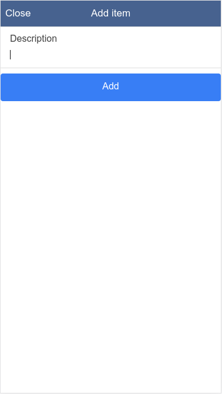

Created notifications can be edited by pressing the pencil icon to the right of the notification, or deleted by pressing the trash can icon.

### Manage locations

####_This feature is currently non-functional due to back-end issues._

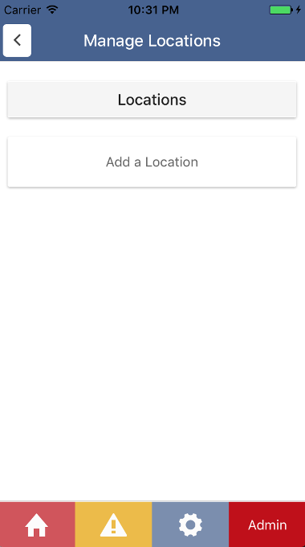

The "Manage Locations" screen allows admins to add volunteer locations, which can then be used to create new shifts.

Locations are displayed in the "Locations" tab, and can be edited and deleted using the pencil and trashcan icons respectively.

You can add volunteer locations by pressing the "Add a Location" button. You will be prompted for a name for the location, along with all the details about where it actually is. You can then press "Add" to add it to the list.

**Note: A location has to be created before you can create new shifts in the "Manage Times" screen.**

### Manage Times

####_This feature is currently non-functional due to back-end issues._

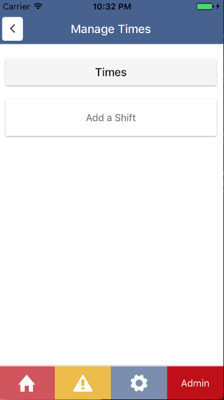

The "Manage Times" screen allows admins to manage when volunteer shifts should take place. Times are displayed in the "Times" tab, and can be edited and deleted using the pencil and trashcan icons respectively.

You can add a volunteer shift by pressing the "Add a Shift" button. you will be prompted to select the location of the shift, the job description (Packer or Driver), a date, and a time. You can then press "Add" to add the new time to the list.
